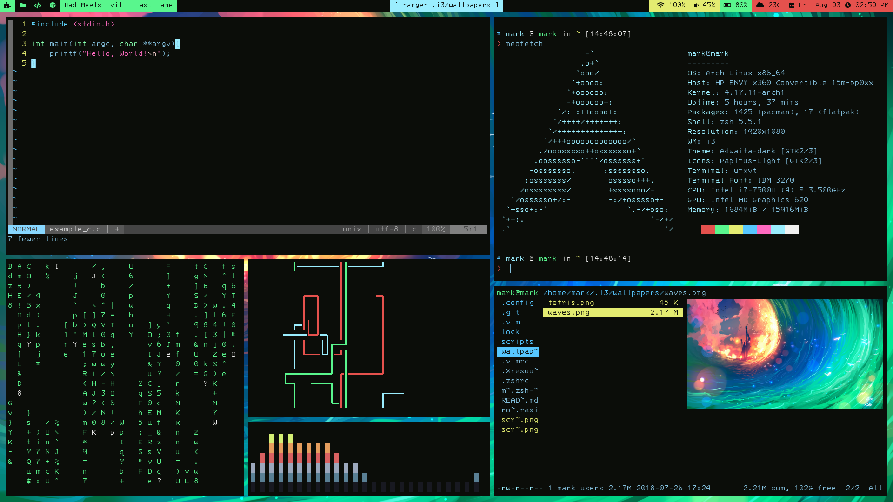
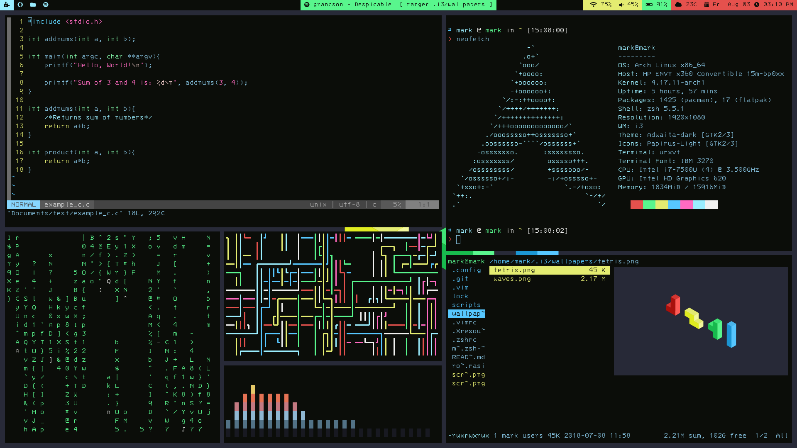

# Tetris Rice for i3wm-gaps

Note: I know this was supposed to be tetris one, but the setup just looks much better with the other wallpaper with minor changes. Choose what you want of course. 
Use polybar configs as you like

### Reqs:
* [i3 gaps](https://github.com/Airblader/i3)
* [rofi](https://github.com/DaveDavenport/rofi)
* [nitrogen](https://wiki.archlinux.org/index.php/nitrogen)
* [python-pywal](https://github.com/dylanaraps/pywal)
* [Betterlockscreen](https://github.com/pavanjadhaw/betterlockscreen)
* [compton](https://wiki.archlinux.org/index.php/Compton)
* [polybar](https://github.com/jaagr/polybar)
* [spotify-cli-linux](https://github.com/pwittchen/spotify-cli-linux) (for polybar)
* [zsh](https://wiki.archlinux.org/index.php/zsh) and [oh-myzsh](http://ohmyz.sh)
* [dunst](https://github.com/dunst-project/dunst)

replace the ys.zsh-theme with modified_ys.zsh-theme in ~/.oh-my-zsh/themes (or not...not a major difference)

### Scripts:
* [Weather](https://github.com/icemodding/i3/tree/master/scripts)
* [Uptime](https://github.com/mohabaks/dotfiles/blob/master/config/polybar/.config/polybar/uptime) (not in screenshot)

### Wallpapers

