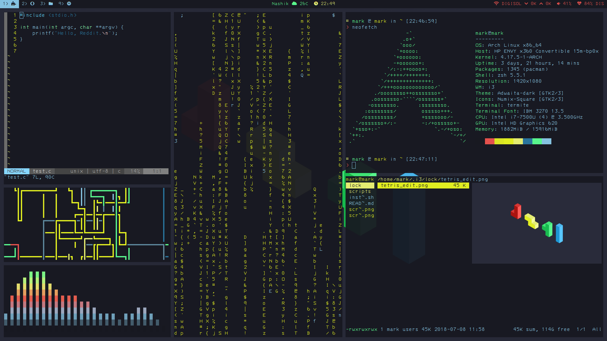
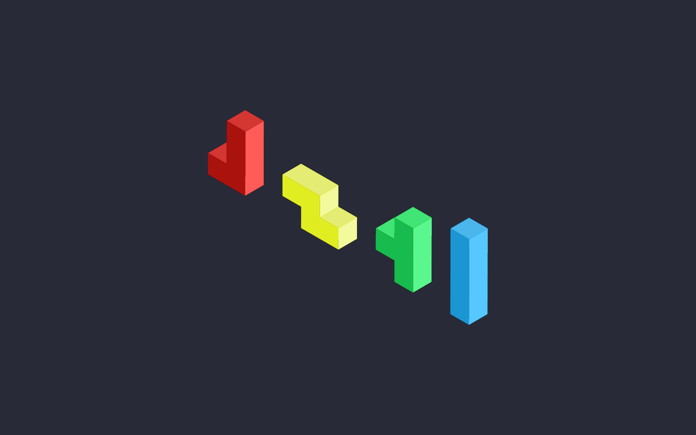

# Tetris Rice for i3wm-gaps

Note: I know this was supposed to be tetris one, but the setup just looks much better with the other wallpaper with minor changes. Choose what you want of course.

### Reqs:
* [i3 gaps](https://github.com/Airblader/i3)
* [rofi](https://github.com/DaveDavenport/rofi)
* [nitrogen] (https://wiki.archlinux.org/index.php/nitrogen)
* [python-pywal] (https://github.com/dylanaraps/pywal)
* [Betterlockscreen](https://github.com/pavanjadhaw/betterlockscreen) and it's dependencies
* [compton](https://wiki.archlinux.org/index.php/Compton)
* [termite] (https://github.com/thestinger/termite)
* [polybar](https://github.com/jaagr/polybar)
* [zsh](https://wiki.archlinux.org/index.php/zsh) and [oh-myzsh](http://ohmyz.sh)

### Scsripts:
* [Spotify](https://github.com/firatakandere/i3blocks-spotify) (for i3blocks)
* [Weather](https://github.com/icemodding/i3/tree/master/scripts)
* [Powermenu](https://github.com/vivien/i3blocks-contrib/tree/master/shutdown_menu)
which uses rofi or zenity
* [Uptime](https://github.com/mohabaks/dotfiles/blob/master/config/polybar/.config/polybar/uptime) (not in screenshot)

### Vim:
* [pathogen] (https://github.com/tpope/vim-pathogen)
* [auto-pairs] (https://github.com/jiangmiao/auto-pairs)
* [lightline] (https://github.com/itchyny/lightline.vim)
* [nerdtree] (https://github.com/scrooloose/nerdtree)
* [sparkup] (https://github.com/rstacruz/sparkup)
* [supertab] (https://github.com/ervandew/supertab)
* [syntastic] (https://github.com/vim-syntastic/syntastic)

### Wallpapers

